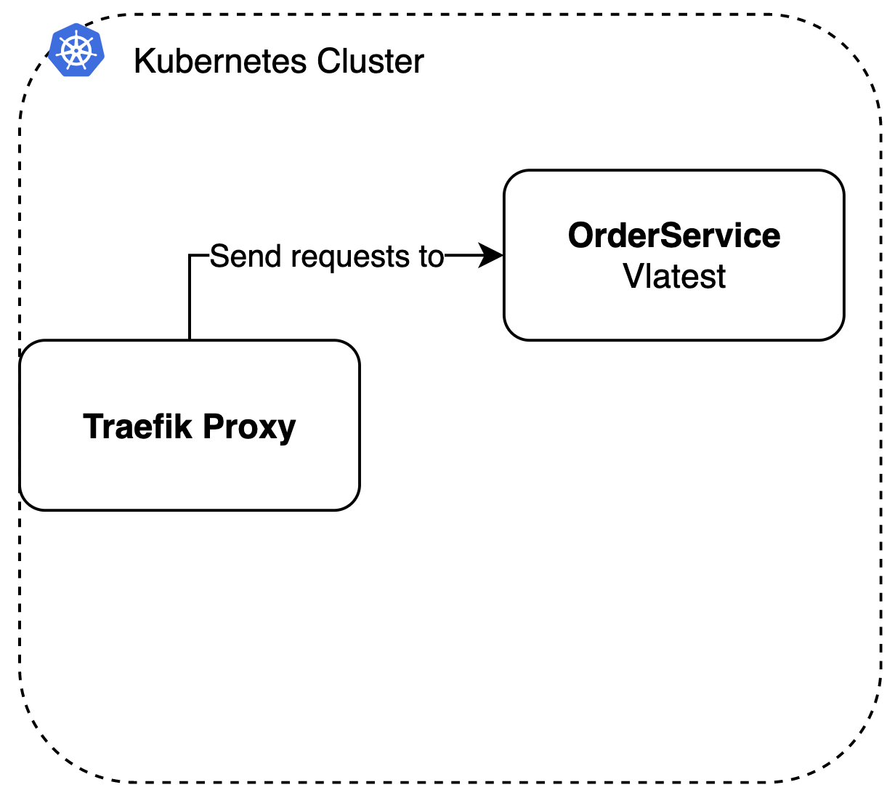
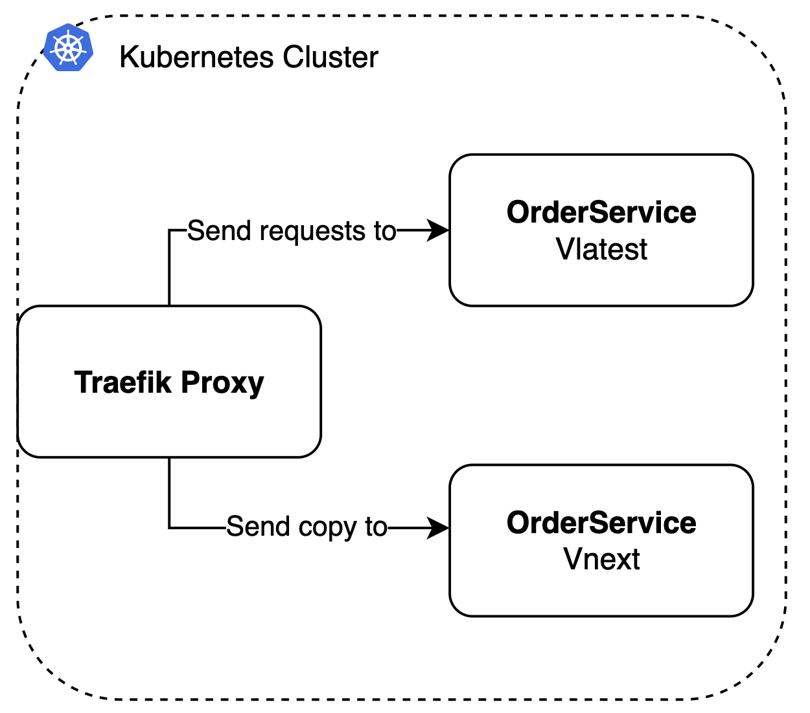

As described on the dark launch page, an external dark launch means that the request originates from outside you infrastructure (e.g. cluster). This page shows an example implementation of an external dark launch.

For this example we use the [prodtest-demo](https://github.com/brdv/prodtest-demo) project.

## TLDR;

In this example we implement an external dark launch using a [Traefik proxy](https://traefik.io). The software runs in a kubernetes cluster. ([Check kubernetes manifests here.](#))

## The use case

Let's say you have a burger restaurant 🍔. You have an application that handles all incoming orders, and passes them to a kitchen. The kitchen then handles the orders and returns the order in a OrderHandled object.
As manager of this burger restaurant, you want to test a new setup of the kitchen and check if this will handle orders faster. You decide to use a dark launch to test your new kitchen.

The use case as described above has two main components. The 'thing' where the orders are registered, and the kitchen. In this example we will call them `OrderController` and `KitchenService` respectively. These components together form the RegisterService (as in registry). All your software runs in a kubernetes cluster (in the ☁️ ofcourse!) and requests go through a [Traefik proxy](https://traefik.io).

Your (simplified) architecture is as follows:



The desired architecture is:



## Implementation

This section describes how to implement an external dark launch using Traefik proxy.

### Traefik

Great! You already have the cluster up and running. Now you want to add the new version of the RegisterService (with updated kitchen setup) to the cluster as a Vnext instance. Traefik has an option to implement data mirroring\*. Data mirroring is a technique that copies (a percentage) of data (request) that goes through a proxy.

Once everything is setup and configured correcly for Traefik, you can start using custom traefik resources. In this example, we will use a [TraefikService](https://doc.traefik.io/traefik/routing/providers/kubernetes-crd/#kind-traefikservice) to use custom Traefik features and an [IngressRoute](https://doc.traefik.io/traefik/routing/providers/kubernetes-crd/#kind-ingressroute); an easier way to implement an ingress controller to your cluster. The TraefikService allows us to easily use Traefiks HTTP router with all of its features, like mirroring.

\* Before you can implement data mirroring within your cluster using Traefik, you have to install some custom [CRD's](https://doc.traefik.io/traefik/providers/kubernetes-crd/), or you can use the [Traefik Helm Chart](https://doc.traefik.io/traefik/getting-started/install-traefik/#use-the-helm-chart). The latter is used in the demo project.

### Resource definition

Next step is to define your kubernetes resources. As mentioned in the section above, we'll use two CRD's of Traefik for this: TraefikService and IngressRoute.
The IngressRoute is implemented as follows:

```yaml showLineNumbers
apiVersion: traefik.containo.us/v1alpha1 # < define the resource definition you use, in this case traefik's resources
kind: IngressRoute # < Specify resource type.
metadata:
  name: prodtest-crd
spec:
  entryPoints:
    - web # < when to use this routes, in this case on each request to port 80.
  routes:
    - kind: Rule
      match: Host(`localhost`) # < The rule to match for the services in the block below.
      services:
        - name: dl-mirror # < name of the service to foreward to.
          namespace: default
          kind: TraefikService # < As you can see, it's a TraefikService
```

As you can see on line 1 we specify that we're using the resource definition of Traefik. On line 2 we specify the resource we want to use, an IngressRoute.
Line 7 tells the IngressRoute to use the following routes on all incoming requests on port 80 (web).
The match statment adds a rule that only executes the following block if the domain of the request is `localhost`.
On line 12 and 14 the name of the service to send the requests to is specified, and as you can see, it's a TraefikService.

Let's take a look at the TraefikService configuration:

```yaml showLineNumbers
apiVersion: traefik.containo.us/v1alpha1
kind: TraefikService # < Specify resource type.
metadata:
  name: dl-mirror # < the name, as used in the IngressRoute
  namespace: default

spec:
  mirroring: # < Specify that we want to use mirroring.
    name: register-service-latest # < The service to use by default.
    port: 80
    mirrors:
      - name: register-service-next # < The service to mirror to.
        port: 80
        percent: 100 # < The percentage of requests to mirror.
```

On line 2, we specify that this resource is a TraefikService, and we give it the name dl-mirror (line 4) as specified in the IngressRoute configuration.
We specify that we want to use mirroring by adding a `mirroring` block to the spec on line 8.
Inside this block we specifiy what and how we want to mirror incoming requests. The first block (line 9) is the service we use by default, meaning that all requests will go here and the responses of the used service will be returned. On line 12 we specify what service to mirror requests to and the last line specifies what percentage if incoming requests must be mirrored. In this case 100% (all requests).

### Applying resources

Once you've setup both resources, you have to apply them to your kubernetes cluster.
Note that this example uses the manifests from the demo project. You can alter the manifests above to suit your needs.

If you want to test this implementation yourself, checkout the [prodtest-demo](https://github.com/brdv/prodtest-demo) repository!

Clone the repo to your local machine, follow the README instructions, rund the scripts. Boom! You should have a (local) dark launched RegisterService up and running in no time!
