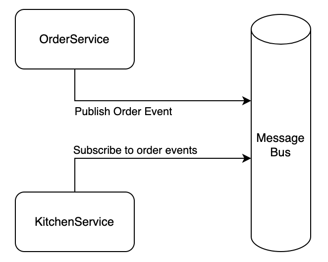
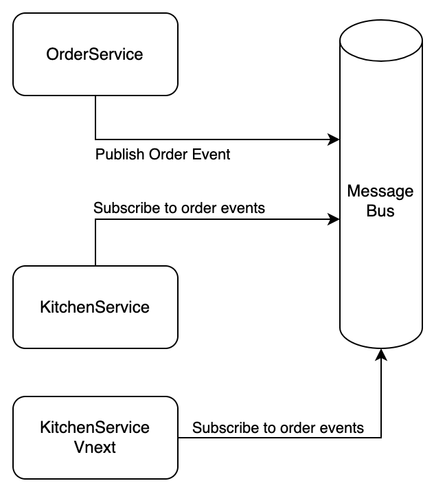

As described on the dark launch page, an internal dark launch is a dark launch that happens between two clusters. In this case, the traffic does not pass through a proxy. The two services have another way of communication.

For this example, we use the [prodtest-demo](https://github.com/brdv/prodtest-demo) project.

## TL;DR

In this example, we implement and internal dark launch for two services that communicate via a Message Queue. The software runs in a kubernetes cluster. ([See kubernetes description.](../technical-detail/kubernetes-setup.md))

## The use case

In the demo project we have two main components; the [order service](../technical-detail/order-service.md), and the [kitchen service](../technical-detail/kitchen-service.md).

Let's say you want to test a new kitchen, which should increase the speed of handling orders. The kitchen service checks the queue for new orders, and will process and prepare the new orders.
As manager of this burger restaurant, you want to test another way to prepare orders. You decide to use a dark launch to test this new process.

One important part of this use case is that you want to handle all or some of the orders that appear on the queue by both the current (Vlatest) and the next (Vnext) version of the kitchen service. To do so, you have to make sure that multiple services can be suscribed to the same messages or queues.

The simplified base architecture is as follows:



You want to be able to do somthing like:



In this case (the latter), you want both Vnext and the main kitchen service to be able to process the **same** images.

## Implementation

This section describes how the use case is implemented. Note that these examples are from the [prodtest-demo](https://github.com/brdv/prodtest-demo) project. A more elaborate description of the classes of the code snippets below can be found in technical descriptions of the [order service](../technical-detail/order-service.md) and the [kitchen service](../technical-detail/kitchen-service.md).

To start, you have to make sure that it is possible to have multiple subscribers listening to the same messages and that those message will not be deleted once read.

### RabbitMQ Exchanges

The message queue used in the demo project is RabbitMQ. It provides a feature that does exactly what we want: [exchanges](https://www.rabbitmq.com/tutorials/amqp-concepts.html#exchanges).

An exchange is basically a middleman that all messages are sent to. It allows the message to be sent to mulitple queues. In this case, we want the order service to send all messages to the 'main' exchange. The exchange will send the message to all queues that are bound to the exchange. Therefore, all services that have a queue that is bound to the exchange, will receive the messages.

This is implemented as follows:

#### Publishing messages:

```csharp showLineNumbers
public void PublishEvent(string hostname, string message, string exchange)
{
    var factory = new ConnectionFactory() { HostName = hostname };
    using (var connection = factory.CreateConnection())
    using (var channel = connection.CreateModel())
    {
        channel.ExchangeDeclare(exchange, ExchangeType.Fanout);

        var encodedBody = Encoding.UTF8.GetBytes(message);

        channel.BasicPublish(exchange: exchange,
                                routingKey: "",
                                basicProperties: null,
                                body: encodedBody);
    }
}
```

The method above is located in the RabbitMQService.

As you can see, after we have set up a connection to the RabbitMQ instance located at the value of the `hostname` parameter, we start by declaring an exchange. After we have encoded the message into a variable named `body` we can publish the message by calling `.BasicPublish`. This method takes various parameters, the important parts here are the exchange, which is set to be the `exchange` parameter of the method and the body (a.k.a.) the message you want to publish, set to the encoded message in the variable `body`. (Note that we do not (yet) have to declare an actual queue, RabbitMQ takes care of this for us.)

#### Subscribing to messages

```csharp showLineNumbers
public void Run(string exchangeToUse)
{
    var factory = new ConnectionFactory() { HostName = RMQHost };
    using (var connection = factory.CreateConnection())
    using (var channel = connection.CreateModel())
    {
        channel.ExchangeDeclare(exchangeToUse, ExchangeType.Fanout);

        var queueName = channel.QueueDeclare().QueueName;

        channel.QueueBind(queue: queueName, exchange: exchangeToUse, routingKey: "");

        var consumer = new EventingBasicConsumer(channel);

        consumer.Received += (model, ea) =>
        {
            var body = ea.Body.ToArray();
            var decodedBody = Encoding.UTF8.GetString(body);
            var order = JsonSerializer.Deserialize<OrderModel>(decodedBody);

            if (order != null)
            {
                _service.HandleOrder(order);
            }
            else
            {
                Console.WriteLine("Something went wrong. Order is empty");
            }
        };

        channel.BasicConsume(queue: queueName,
                                autoAck: true,
                                consumer: consumer);
    }
}
```

This snippet is from the `KitchenWorker` class, as described [here](../technical-detail/kitchen-service.md).

Once again, we have to set up a connection with the RabbitMQ instance first. In this case the host scoped to the class.
When we have a connection, we first check if the exchange already exists on line 7 by calling `.ExchangeDeclare` (Note: this method like an [upsert](https://cockroachlabs.com/blog/sql-upsert/#what-is-an-upsert-in-sql) in SQL).. Then on line 11 it binds the queue it create on line 9 to that exchange.
Once the queue is bound, it creates a consumer for events on that queue. This consumer will listen to the queue an on a received message, perform the steps on line 17-28. These lines will decode the encoded message, serialize it to an `OrderModel` and if it is a valid order, pass it on to the service (which is a dependency in this class).
