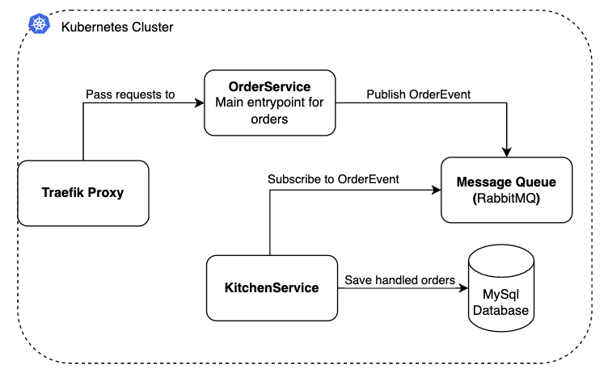

**This page is an exact copy of the README.md file found in the [prodtest-demo](https://github.com/brdv/prodtest-demo) project.**

# Prodtest demo

This is the readme for the prodtest demo project. For more information, check the [docs](https://brdv.github.io/prodtest-docs).

The current project architecture is as follows:



## Contents

The contents of this Readme are:

- [Prerequisites](#prerequisites)
- [Setup](#setup)
- [Checking the demo project](#checking-the-demo-project)
- [Useful scripts](#useful-scripts)
- [Troubleshooting](#troubleshooting)

## Prerequisites

In order to run the project, please make sure the following tools are installed:

- [Docker](https://docs.docker.com/get-docker/)
- [Kubectl](https://kubernetes.io/docs/tasks/tools/)
- [Helm](https://helm.sh/docs/intro/install/)

\* **Note:** Please use [WSL](https://learn.microsoft.com/en-us/windows/wsl/install) if you are on windows

To check if everything is installed correctly, run the following commands:

```bash
# for docker
docker --version
# for kubectl
kubectl version --short
# for helm
helm version --short
```

If it outputs a version number, the installation has succeeded.

## Setup kubernetes cluster

Follow the guide below to setup and start the project.

1.  Once all prerquisites are installed, make sure you have a docker kubernetes cluster running following [this guide](https://docs.docker.com/desktop/kubernetes/#enable-kubernetes).

2.  Next make sure the docker-desktop kubernetes context is selected for kubectl:

    ```bash
    # 1) get all contexts
    kubectl config get-contexts

    # 2) set docker-desktop context if not set already *
    kubectl config set-context docker-desktop
    ```

    \* you can see if docker-desktop is selecten in the output of command 1.

TL;DR;

If you want to get everything up and running quickly, you can enter the following command and skip step 3-5:

```bash
sh ./scripts/docker/build-prodtest-images.sh latest;sh ./scripts/docker/build-prodtest-images.sh vnext; sh ./scripts/kubernetes/setup-infra.sh;sh ./scripts/kubernetes/setup-darklaunch.sh
```

3.  Build all docker images (locally)

    Run the build scripts to create local docker images.

    ```bash
    # from the projects root folder:
    sh ./scripts/docker/build-prodtest-images.sh latest
    sh ./scripts/docker/build-prodtest-images.sh vnext
    ```

4.  Apply infrastructure resources:

    Run setup-infra script

    ```bash
    # from the projects root folder:
    sh ./scripts/kubernetes/setup-infra.sh
    ```

    **NOTE**: Because it takes some time for the infrastructure to be completed; the script waits 30 secs.

5.  Apply other kubernetes resourcess

    ```bash
    # from the projects root folder:
    sh ./scripts/kubernetes/setup-darklaunch.sh
    ```

    This will apply all resources to the cluster. You will see all resources in the console. (Run `kubectl get all` if they do not show up.)

Nice job, you've successfully set up all resources for this demo project. You can now proceed to the next section, checks.

## Checking the demo project.

1. First of all you can check if the API is up and running by going to "http://localhost/api/health". You should then see a JSON object as follows:

   ```json
   {
     "health": "ok"
   }
   ```

2. To see the Traefik (proxy) dashboard, run the following command:

   ```bash
   kubectl port-forward $(kubectl get pods --selector "app.kubernetes.io/name=traefik" --output=name) 9000:9000
   ```

   Leave the shell open and go to http://localhost:9000/dashboard/

3. You can check the Prometheus metrics by running the following command:

   ```bash
   kubectl port-forward $(kubectl get pods --selector "app.kubernetes.io/name=traefik" --output=name) 9000:9100
   ```

   Leave the shell open and go to http://localhost:9000/metrics/

4. Next you can call the API a couple of times by using the simulate script:

   ```bash
   sh ./scripts/simulate_api_calls.sh -n 10
   ```

   \* the `-n 10` specifies the number of times to call the API (in this case, 10 times)

   After running the script, you can check the responses of the API in `temp/request_output.json`. Thereby you can check the metrics endpoint in step `3`, however, currently this is a bit cryptic.

5. Check the database:

   To check the database you can do two thing: open a database management tool and connect to it (you have to port-forward the pod) or directly connect to the pod and run the mysqlsh CLI.

   The default database user is `prodtest` and the default password is `prodtest-dl`.

   To port-forward the pod:

   ```bash
   kubectl port-forward service/prodtest-db 13306:3306
   ```

   Note: this binds the local port `13306` to the default MySql port in the database pod. This is done to make sure no errors occur when you have a local MySql database running.

   You can now make a connection to the database from your preferred database management tool (i.e. datagrip, sequelace).

   To interact via the MySql sh CLI enter the following:

   ```bash
   kubectl exec --stdin --tty prodtest-db-0 -- /bin/mysqlsh --sql -u prodtest
   ```

## Useful scripts

There are a few other commands that can be helpful during testing or development.

1. Cleanup kubernetes and helm charts

   If for any reason you want to clean up the configured kubernetes resources you can enter the following command in the terminal:

   ```bash
   sh ./scripts/kubernetes/cleanup.sh
   ```

   \* **Note:** This script may take some time due to shutdown time of some pods.
   In some cases, the cleanup script does not successfully delete all database pods. The reason why this happens is yet unknown. You can hard delete it by resetting your Docker Desktop Kubernetes cluster or deleting all docker containers prefixed with `k8s_`. If this still does not work, please [open a new issue](https://github.com/brdv/prodtest-demo/issues/new/choose).

2. Simulate API requests

   In order to simulate API requests, you can use the script `simulate_api_calls.sh`. This script will by default call the api 500 times and save the responses to `temp/request_output.json`.
   Use the script as follows:

   ```bash
   sh ./scripts/simulate_api_calls.sh
   ```

   \* _In case of an error like 'jq command does not exist' [install jq](https://stedolan.github.io/jq/download/)_

3. Check RabbitMQ dashboard

   You can access the RabbitMQ dashboard by port forewarding its instance.

   ```bash
   sh ./scripts/pfw-rabbitmq.sh
   ```

   Now open the browser at http://localhost:15672 and log in with the credentials in your console.

\* **Note:** In some cases, the cleanup script does not successfully delete all database pods. The reason why this happens is yet unknown. You can hard delete it by resetting your Docker Desktop Kubernetes cluster or deleting all docker containers prefixed with `k8s_`. If this still does not work, please [open a new issue](https://github.com/brdv/prodtest-demo/issues/new/choose).

## Troubleshooting

This section contains known issues and how to fix them.

1. traefik-dl service external-ip \<pending\>

   If the api is not reachable, this probably happened because the external ip for the traefik proxy (service/traefik-dl) is pending (run `kubectl get service` to check). This is most likely caused because you have something else running locally that uses port 80. To fix this issue, close all apps that use port 80 on your machine. If this still does not work, restart your machine and try again.

   If the issue persists, please open an issue and provide your `kubectl get service` output.
