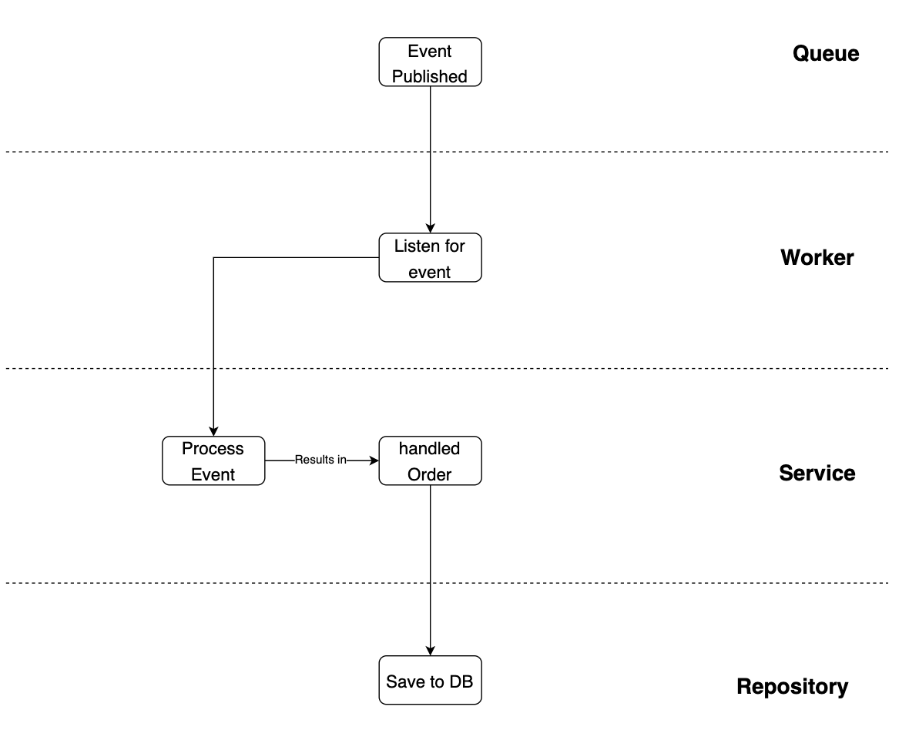
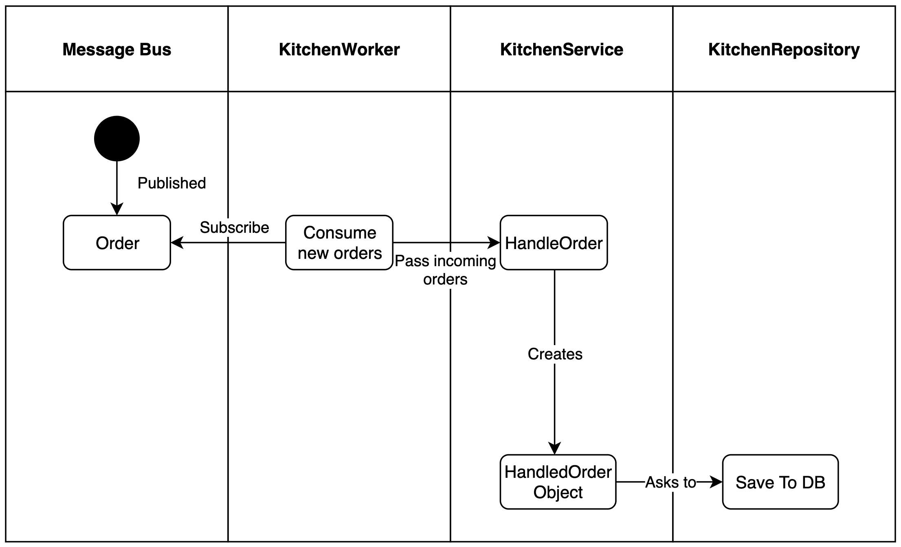
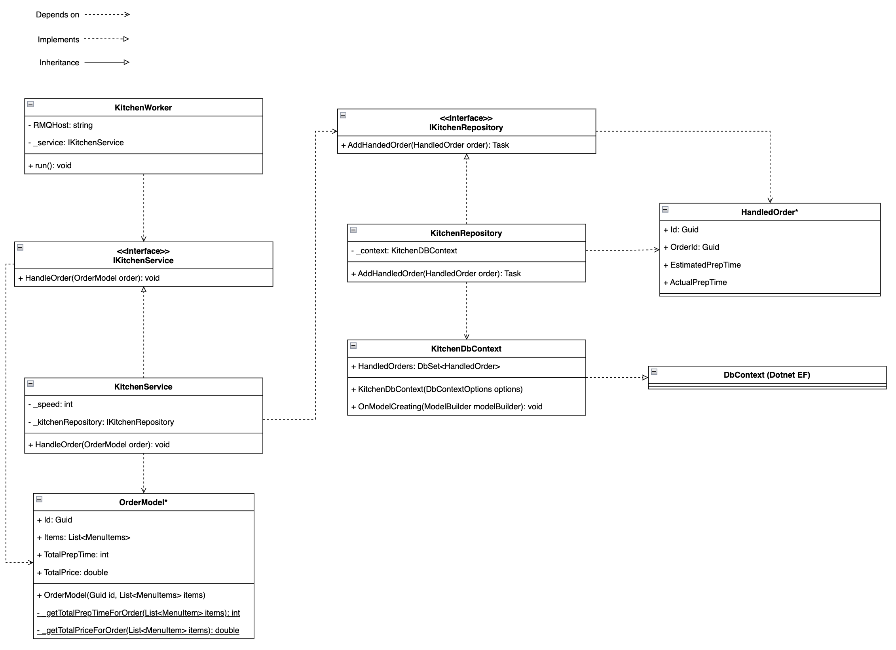
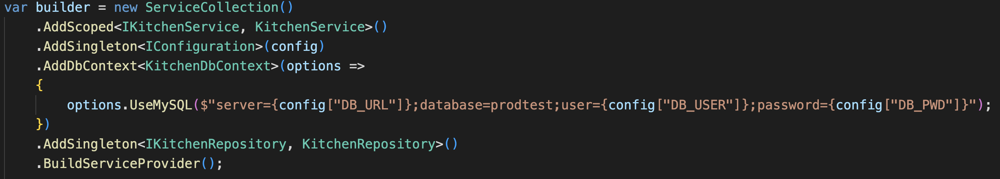

The kitchen service consumes new order events that are published on the message queue. Once an order is published, it will handle the order and store a OrderHandled object into a database.

## Architecture

The kitchen service is a .NET Console Application and consists of three main layers. Note that on the image below, the Message Queue has been taken into account but this is actually not a primary part of the kitchen service.

The worker layer is responsible for collecting new orders from the queue. The service will handle the order as needed and eventually pass it on to the repository layer. This last layer will make sure the HandledOrder is saved to the database.

## Flow

The flow of the kitchen service is as follows:

Once a new order is published on the queue, the KitchenWorker will collect and deconstruct it. This results in an OrderModel. This OrderModel will then be passed to the KitchenService. The KitchenService will then "handle" the order. The preparation of the order is mocked and this will result in a preparation time that is dependent on the estimated preparation time of the order and the speed of the kitchen. When the order is complete, the service will create a new HandledOrder object. This object basically holds all relevant information of the handled order. The handled order will then be passed on to the repository layer, which saves it to the database.

## Implementation

The above layers and flow are implemented as followed:

Note: all classes marked with an asterisk (\*) can be found in the Domain.Commons project. They are not directly part of the kitchen service, but it does depend on them.

<!-- TODO: Add link to domain.commons project above and below. -->

As you can see in the image above. The kitchen service consists of various classes.

The main starting point is the `KitchenWorker`. This class is responsible for subscribing and listening to the message queue for new orders. It depends on the `IKitchenService`, in the form of the `KitchenService`. This service is responsible for handling orders and is dependent on the `IKitchenRepository` in the form of the `KitchenRepository` implementation. The `KitchenRepository` functions as a data access layer over the database and is dependent on the `KitchenDbContext`. This class makes the connection with the database and sets up al relevant tables and data models. It is a subclass of Entity Framework's [`DbContext`](https://learn.microsoft.com/en-us/dotnet/api/system.data.entity.dbcontext?view=entity-framework-6.2.0).
Thereby, in the class diagram, you can find two model classes. An `OrderModel`, and a `HandledOrder`. These classes are not directly part of the kitchen service, but the Domain.Commons project. The kitchen service is dependent on these classes and uses them via a project reference.

## Dependencies

In the class diagram above you see two services; the (I)KitchenService, (I)KitchenRepository and the (I)KitchenDbContext. These services are created and passed by using [dependency injection](https://learn.microsoft.com/en-us/aspnet/core/fundamentals/dependency-injection?view=aspnetcore-7.0). An example of how this is implemented can be found below.

## Development choices

Below you find a table containing (architectural) decisions with their context, options, choice and rationale.

| Context                                                                                                                                      | Options                                                 | Choice         | Rationale                                      |
| -------------------------------------------------------------------------------------------------------------------------------------------- | ------------------------------------------------------- | -------------- | ---------------------------------------------- |
| In order to make sure the HandledOrders data of Vnext will not pollute Vlatest data, we need to separate the data generated by both services | Separate database, separate table, extending data model | Separate table | See [this](./data-separation.md#database) page |
