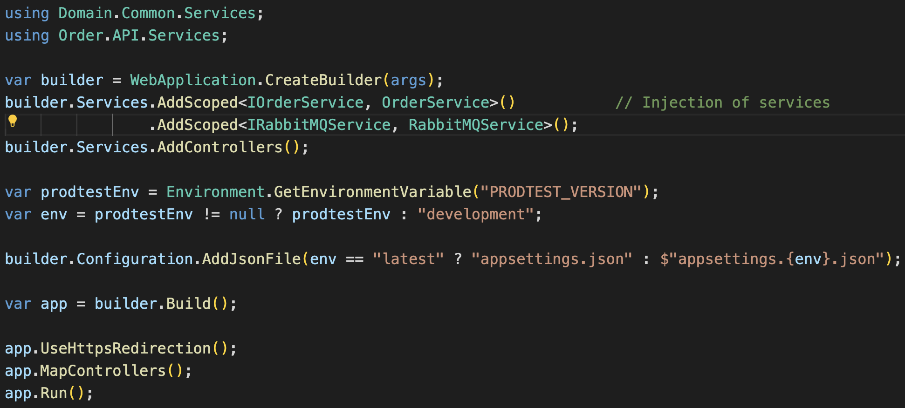

This page describes how the RabbitMQ message queue is implemented in the [demo project](https://github.com/brdv/prodtest-demo). Since there is already quite some documentation about the queue on this documentation site, this page will limit to how RabbitMQ is implemented in the project.

## RabbitMQ

The message queue provider we use for the demo project is [RabbitMQ](https://rabbitmq.com/#getstarted). It is used to allow communication between the order service and the kitchen service. Therefore, an implementation is used in both projects.

To interact with RabbitMQ instances, we use the official [RabbitMQ nuget package](https://www.nuget.org/packages/rabbitmq.client/). It is added to both the order and kitchen service.

### Order service implementation

The order service interacts with RabbitMQ via the RabbitMQService. This is a simple wrapper around RabbitMQ's functionality. The complete service can be found below:

```csharp showLineNumbers
public class RabbitMQService : IRabbitMQService
{
    public void PublishEvent(string hostname, string event, string exchange)
    {
        var factory = new ConnectionFactory() { HostName = hostname };
        using (var connection = factory.CreateConnection())
        using (var channel = connection.CreateModel())
        {
            channel.ExchangeDeclare(exchange, ExchangeType.Fanout);

            var body = Encoding.UTF8.GetBytes(event);

            channel.BasicPublish(exchange: exchange,
                                 routingKey: "",
                                 basicProperties: null,
                                 body: body);
        }
    }
}
```

As you can see, it is quite simple and only has one method: `PublishEvent`. This method takes three arguments: the hostname of the RabbitMQ instance, the event to publish and the exchange to publish to. (Note we use exchanges in stead of queues for publishing, more about that [here](../examples/internal-dl.md).)
The method creates a new Connection factory with the given hostname, from that factory it creates a connection en thereof a channel. All of these items are disposables, therefore using the `using` statement.
In order to safely publish events on the queue, we have to encode it as UTF8 and transfer it into a Byte array (see line 11).

The RabbitMQService is injected into the OrderService as follows:



The OrderService then uses the RabbitMQService in the PublishNewOrder method, that is called from another method in the same class. See the PublishNewOrder function below:

```csharp showLineNumbers
private void PublishNewOrder(OrderModel order)
{
    var serializedOrder = JsonSerializer.Serialize(order);
    var versionTag = _configuration["DL_INTERNAL_TAG"];

    _rmqService.PublishEvent(_configuration["RMQ_HOST"], serializedOrder, $"dl-exchange-{versionTag}");
}
```

As mentioned before, the RabbitMQService is injected into the OrderService with dependency injection (see [here](./order-service.md#dependencies)). This code snipped serializes the order into a Json string and calls the `PublishEvent` method on the RabbitMQService, providing all relevant parameters.

Note: the versionTag is part of the in `appsettings.json` provided variables. It is used to specify what exchange to publish the messages to. More about this [here](./data-separation.md#message-queue).

### Kitchen service implementation

The kitchen service consumes new messages from RabbitMQ. It does so by binding a new queue to the exchange that the order service publishes messages to. A good description thereof can be found [here](../examples/internal-dl.md#subscribing-to-messages).
