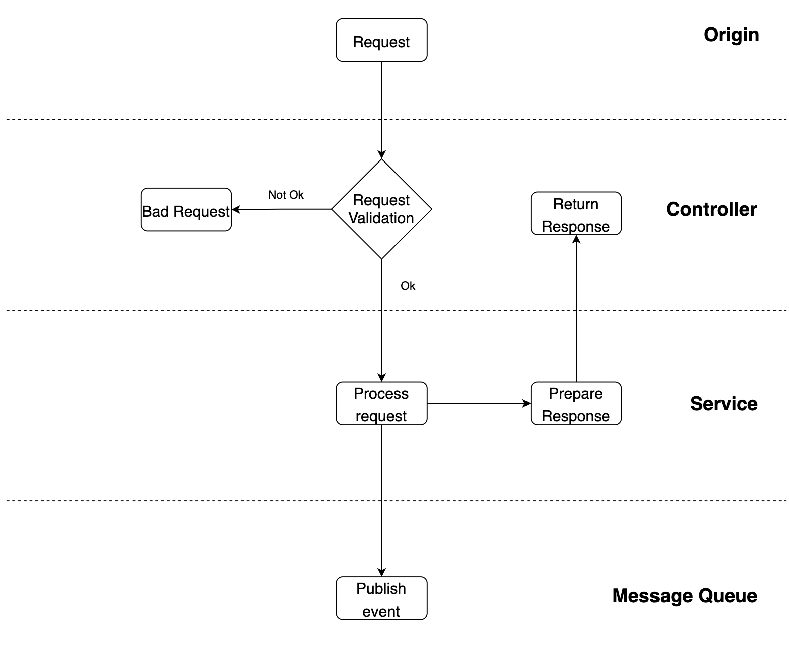
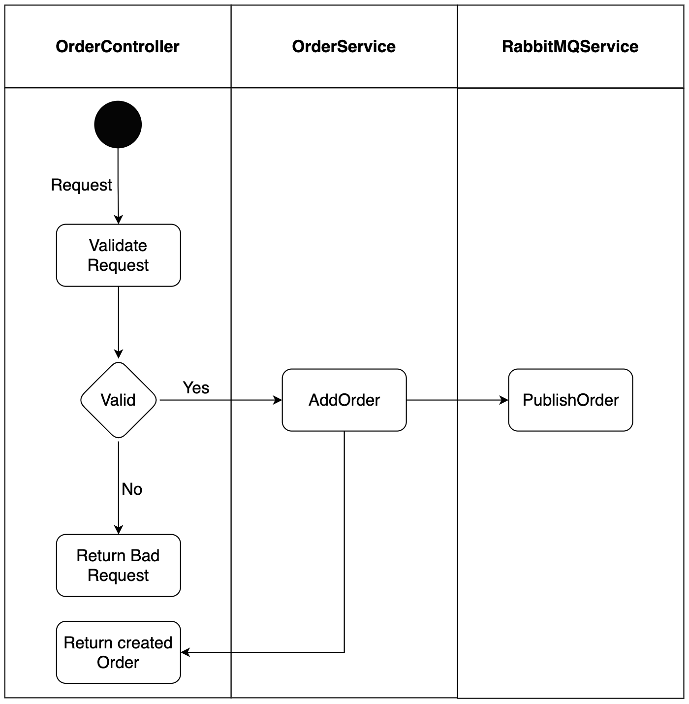
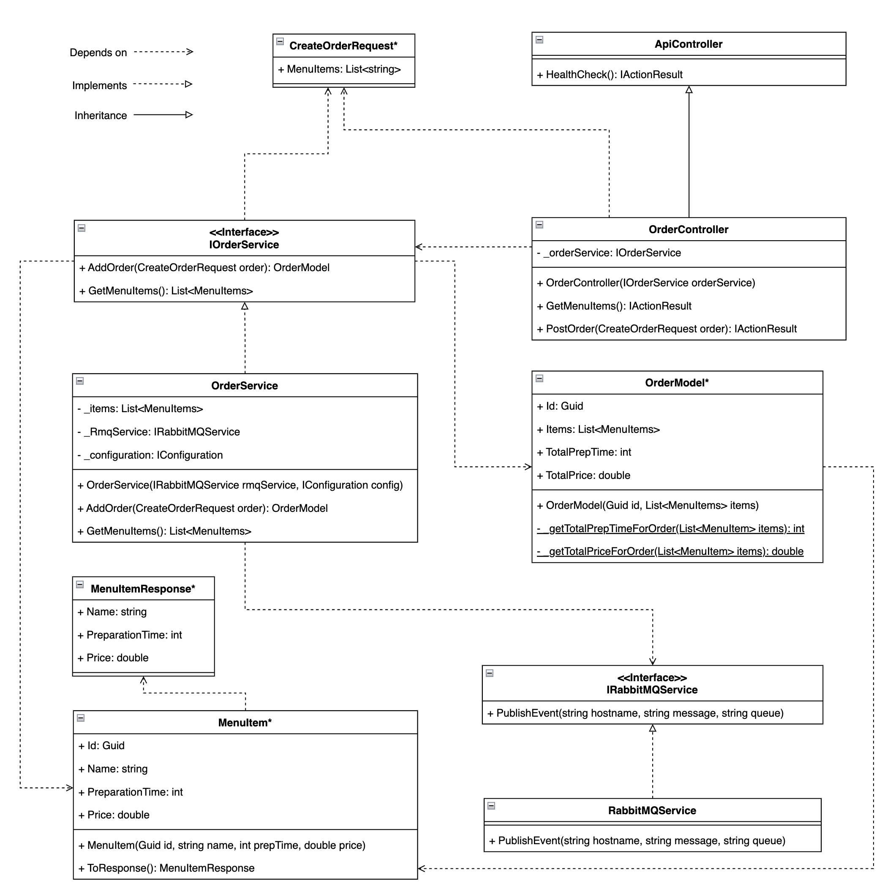

The order service is the first service that will be called by the proxy on incoming requests. This page describes how the service is designed and implemented.

## Architecture

The order service is built as a REST API and consists of three main layers (note: there is no database used in this service): the controller, service and the message queue.

The controller is responsible for receiving and validating requests. The service handles the request, i.e. performs any needed business logic and prepares a response to be returned by the controller. The message queue is used to store messages which other services can consume.
In case the request is invalid, e.g. invalid data in POST request body, the server will respond with an error (in case of invalid data: validation error).

This pattern has been chosen for two primary reasons: testablity and separation of concerns. It separates communication (request, response) and business logic (handler) from each other, thereby decoupling separate concerns within the application. This separation also makes it easier to test individual functionality (methods) independently from each other. (More about testing later).

## Flow

The image below shows an example of a possible flow in the service. (Description below image).

As you can see above, each class/layer is responsible for its own piece of the flow. The controller receives the initital requests and validates them. This means that it checks if it is a proper CreateOrderRequest model. If not, it will return a bad request error to the client. Otherwise, it will pass the request to the OrderService.
The order service (class) handles the business logic of the order. This means it will create an OrderModel object of the request, make sure it will be published by the RabbitMQService on the queue and return the OrderModel to the controller which in turn will send it as response to the client.

## Implementation

Below you can see an overview of the implemented classes to realise the OrderService.

Note: all classes marked with an asterix (\*) can be found in the Domain.Commons project. They are not directly part of the order service, but it does depend on them.

<!-- TODO: Add link to domain.commons project above. -->

### Dependencies

In the class diagram above you see two services; the (I)OrderService and the (I)RabbitMQService. These services are created and passed by using [dependency injection](https://learn.microsoft.com/en-us/aspnet/core/fundamentals/dependency-injection?view=aspnetcore-7.0). An example of how this is implemented can be found below.

## Development Choices

| Context                                                                                 | Options                                                                                             | Choice      | Rationale                                                                                                                                        |
| --------------------------------------------------------------------------------------- | --------------------------------------------------------------------------------------------------- | ----------- | ------------------------------------------------------------------------------------------------------------------------------------------------ |
| In order to receive and allocate requests within the cluster, we need to choose a proxy | [Traefik](https://traefik.io), [NginX](https://www.nginx.com/), [Envoy](https://www.envoyproxy.io/) | **Traefik** | Very [well documented](https://doc.traefik.io/traefik/routing/services/#mirroring-service) data mirroring option + good kubernetes integrations. |
