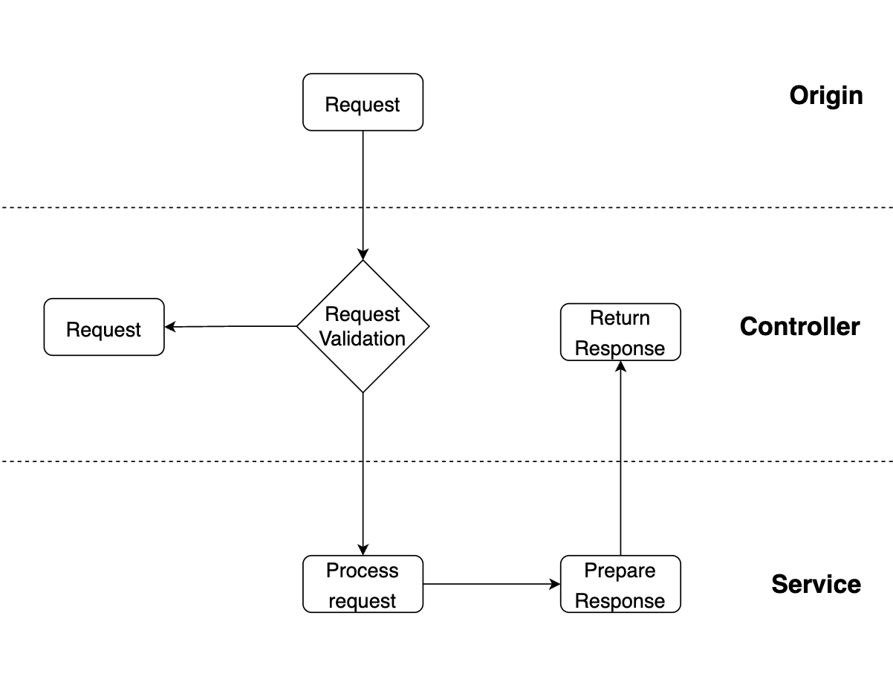
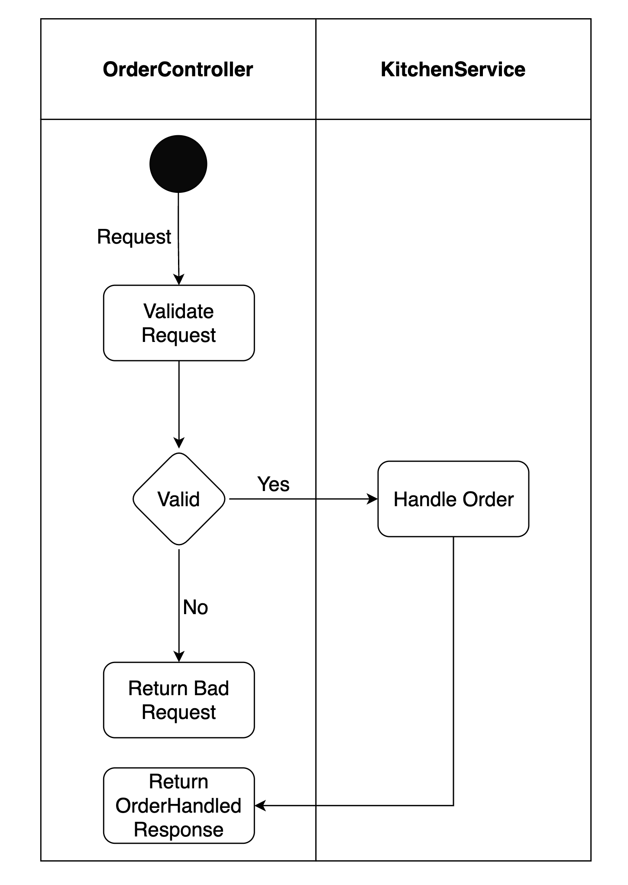

The RegisterService is the first service that will be called by the proxy on incoming requests. This page describes how the service is designed and implemented.

## Architecture

The register service is built as a REST API and consists of two main layers (note: there is no database used in this service): the controller and the service.

The controller is responsible for receiving and validating requests. The service handles the request, i.e. performs any needed business logic and prepares a response to be returned by the controller.
In case the request is invalid, e.g. invalid data in POST request body, the server will respond with an error (in case of invalid data: validation error).

This pattern has been chosen for two primary reasons: testablity and separation of concerns. It separates communication (request, response) and business logic (handler) from each other, thereby decoupling separate concerns within the application. This separation also makes it easier to test individual functionality (methods) independently from each other. (More about testing later).

## Flow

The image below shows an example of a possible flow in the service. (Description below image).

Since this service is quite simple at the moment, the flow above is also quite simple. When a request is received by the OrderController, it validates the request. In case the request is not valid, it returns an appropriate error. If the request is valid, it will foreward the request to the KitchenService. The KitchenService will then handle the order and eventually return an OrderHandled object to the OrderController, which in turn returns this as a response to the client.

## Implementation

Below you can see an overview of the implemented classes to realise the RegisterService.

## Development Choices

| Context                                                                                 | Options                                                                                             | Choice      | Rationale                                                                                                                                        |
| --------------------------------------------------------------------------------------- | --------------------------------------------------------------------------------------------------- | ----------- | ------------------------------------------------------------------------------------------------------------------------------------------------ |
| In order to receive and allocate requests within the cluster, we need to choose a proxy | [Traefik](https://traefik.io), [NginX](https://www.nginx.com/), [Envoy](https://www.envoyproxy.io/) | **Traefik** | Very [well documented](https://doc.traefik.io/traefik/routing/services/#mirroring-service) data mirroring option + good kubernetes integrations. |
