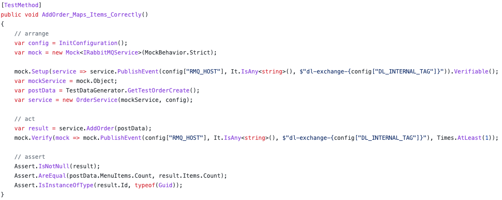

This page describes the way the project is tested. Two types of testing have been applied. Software testing using unit tests and Mutation testing using [Stryker](https://stryker-mutator.io).

## Software testing

Automatic testing is used to ensure basic functionality of the code. This is done by adding the MSTest nuget package. Functionality will be tested on at least one happy and one unhappy flow. An unhappy flow means for example that the software handles faulty inputs correctly.
An example of such a test can be found below:

## Mutation testing

In order to make sure that our tests are actually good. We apply mutation testing to the project by using [Stryker](https://stryker-mutation.io). For a good explanation of mutation testing, please check [this page](https://stryker-mutator.io/docs/).

You can run stryker locally by following [these steps](https://stryker-mutator.io/docs/stryker-net/getting-started/) on their documentation site.
