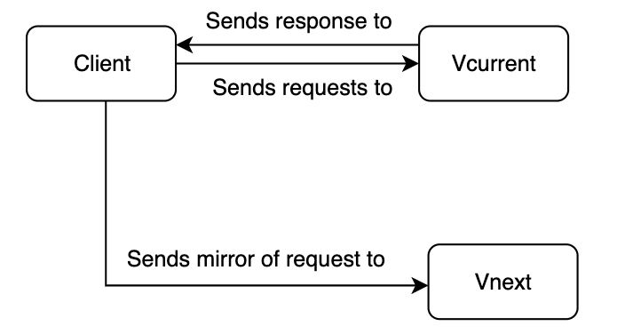
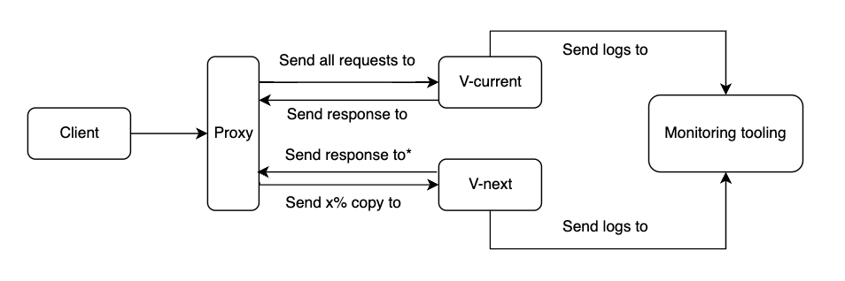

# Dark launch

This page describes a dark launch, also known as shadow release, dark mirror release or dark traffic test but at prodtest we call it a dark launch. A dark launch is a deployment or testing stategy for testing a newer version of a service or piece of software. The main goal of a dark launch is to mirror (a subset of) incoming production traffic to the new service but discarding the response. This allows you to monitor the funcitonality and performance of the service while under a real-world production load without taking the risk of exposing your users to it.

This guide will talk about dark launches more in depth and will show you how you could implement a dark launch.

## What is a dark launch

As mentioned in the top section, a dark launch means that your will deploy two versions of the same service or software. Let's call them Vcurrent (released version) and Vnext (new version). When both versions are deployed you have to mirror (a part of) the incoming requests to Vnext. Mirroring means that somehow (we'll get to that later) you have to send requests to both Vcurrent and Vnext - the mirroring - while letting the user interact solely with Vcurrent. The traffic that is mirrored to Vnext will not result in a response to the user. The basic interaction will look like this:

Note that a more elaborate scheme is depicted in [How to dark launch](#how-to-dark-launch).

## Why would I dark launch

Let's say that you have upgraded an important piece of a service that has to do with an expected response time improvement. You want to test the service to see if the expected speed improvement will actually occur. Because you don't know if the improvement is stable yet, you want to test the service without exposing it to end-users. By implementing a dark launch you can directly test your new service with actual real-world production traffic that is generated by users. Since the response from Vnext is discarded, the end-user will not know about the processing that happens in Vnext.

## How to dark launch

There are two main ways to do a dark launch, both with their own use case.

The first use case is dark launching a service that is accessed by a proxy. Since all requests go through the proxy, we can use that proxy to mirror requests to the Vnext instance. Note that the proxy must support a mirroring options, two examples that do are [NGINX](https://nginx.org/en/docs/http/ngx_http_mirror_module.html) and [Traefik](https://doc.traefik.io/traefik/routing/services/#mirroring-service).

Another use case is when you want to dark launch a service that is not accessed through a proxy but has an internal connection. **_This use case will be explored in a later iteration._**

### Proxy

A proxy - or proxyserver - is a server application that sits in between a client and a resource and that acts as an intermediary. The benefits of a proxy is that the client does not have to have a direct connection to the resource but can request a resource by the proxy. The proxy in turn passes the request to the resource and returns the response. This intermediary can allow you to make a copy of (a percentage of) all incoming requests and send that copy to a newer version of the resource. Both resources can log relevant information that in turn can be sent to a monitoring service. This would look as follows:

\* the response of Vnext will be discarded by the proxy. Only the response of Vcurrent will be sent back.

## Risks of dark launch

Since the goal of a dark launch it to test a new or updated service in a production environment under production load **without** exposing it to end users, the risks of a dark launch are relatively small. However there are a few things to keep in mind when implementing a dark launch.

### Data separation

Since you are testing a new feature in a production envorinment using production data (from the mirrored requests), you have to be very careful nog to save the responses from the new feature or service to the production database that **is** exposed to end users. How you can separate the test and production data in the production environment will be elaborated in a future iteration.

## Example of a dark launch

You can find examples of a dark launch in the [demo project](/demo).
