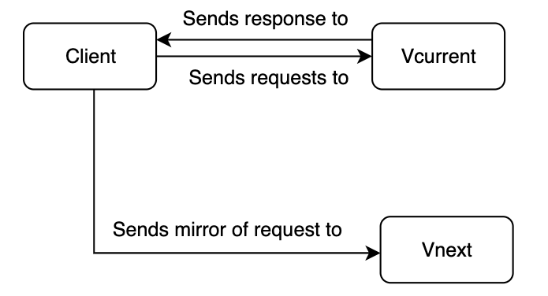

# Dark launch

This page describes a dark launch, also known as shadow release, dark mirror release or dark traffic test but at prodtest we call it a dark launch. A dark launch is a deployment or testing stategy for testing a newer version of a service or piece of software. The main goal of a dark launch is to mirror (a subset of) incoming production traffic to the new service but discarding the response. This allows you to monitor the functionality and performance of the service while under a real-world production load without taking the risk of exposing your users to it.

This guide describes dark launches more in depth and shows various ways to implement a dark launch.

## What is a dark launch

As mentioned in the top section, a dark launch means that you will deploy two versions of the same service or software. Let's call them Vcurrent (released version) and Vnext (new version). When both versions are deployed you have to mirror (a part of) the incoming requests to Vnext. Mirroring means that somehow (we'll get to that later) you have to send requests to both Vcurrent and Vnext - the mirroring - while letting the user interact solely with Vcurrent. The traffic that is mirrored to Vnext will not result in a response to the user. The basic interaction will look like this:

Note that a more elaborate scheme is depicted in [How to dark launch](#how-to-dark-launch).

## Why use a dark launch

Let's say that you have upgraded an important piece of a service that has to do with an expected response time improvement. You want to test the service to see if the expected speed improvement will actually occur. Because you don't know if the improvement is stable yet, you want to test the service without exposing it to end-users. By implementing a dark launch you can directly test your new service with actual real-world production traffic that is generated by users. Since the response from Vnext is discarded, the end-user will not know about the processing that happens in Vnext.

## How to dark launch

There are two main ways to do a dark launch, external and internal, both with their own use case.

The first use case is to dark launch a new (version of) a service that receives requests from outside your infrastructure (e.g. cluster). This is called an external dark launch. In this case you receive a request from an external service or client. You can copy the request at the entrypoint to your infrastructure. Usually, this entrypoint is a proxy service. The idea is that you add a rule to the proxy to - besides sending all requests to Vcur - copy a certain percentage to the Vnext instance. The proxy should then discard the responses from Vnext and only return the response from Vcur.

There are several proxies that support mirroring incoming requests, [NGINX](https://nginx.org/en/docs/http/ngx_http_mirror_module.html) and [Traefik](https://doc.traefik.io/traefik/routing/services/#mirroring-service) are two examples. In the demo project, an example using Traefik has been implemented. ([Check it out!](/demo/examples/external-dl))

The second type of dark launches is a use case where the requests originates from within your infrastructure. The request originates from a service A and goes to service B. Since this all happens within your infrastructure, this type of dark launch is called an internal dark launch. There are several ways to implement an internal dark launch. **_This use case will be explored in a later iteration._**

Which option is best suited for you, depends on your use case. Basically it depends of the architecture and the origin of the request you will use. If you want to dark launch something that receives requests through a proxy, take advantage of that proxy. An example implementation can be [found here](/demo/examples/external-dl).
If your use case consists of communication within a cluster between two services, a proxy implementation of a dark launch might not suffice. In that case, look into other options as [described here](#).

### External

As described above, an external dark launch can benefit the use of a proxy.
A proxy - or proxyserver - is a server application that sits in between a client and a resource and that acts as an intermediary. The benefits of a proxy is that the client does not have to have a direct connection to the resource but can request a resource by the proxy. The proxy in turn passes the request to the resource and returns the response. This intermediary can allow you to make a copy of (a percentage of) all incoming requests and send that copy to a newer version of the resource. Both resources can log relevant information that in turn can be sent to a monitoring service. This would look as follows:

\* the response of Vnext will be discarded by the proxy. Only the response of Vcurrent will be sent back.

### Internal

When you want to dark launch a new service that communicates directly with another service in your cluster, you can use an internal dark launch. Internal meaning that the communication happens within your cluster.

An internal dark launch can be implemented by using a message queue (often in combination with an Event-Driven Architecture, EDA). In this case you have a service (service A), that uses another service (service B) for your application. Normally, service A publishes an event to a message queue, which will be consumed by the subscriber, i.e. service B. You want to test how a new version of service B would handle real-world production data and decide to implement a dark launch.

This would go as follows: setup your message queue to allow multiple consumers for an event. Let both service B vlatest and vnext consume those events and do their work. Eventually, both versions will return an event to the queue. The response of Vnext is flagged in some way (for example: with an origin = vnext property) telling service A to ignore this response. Below you can see a schematic view of this use case:

As you can see, service A only consumes responses (acknowledgement) of the Vlatest service.

## Risks of dark launch

Since the goal of a dark launch is to test a new or updated service in a production environment under production load **without** exposing it to end users, the risks of a dark launch are relatively small. However there are a few things to keep in mind when implementing a dark launch.

### Data separation

Since you are testing a new feature in a production envorinment using production data (from the mirrored requests), you have to be very careful nog to save the responses from the new feature or service to the production database that **is** exposed to end users. There are different ways an application can collect and store data. For example in a database or on a message queue. The [technical details](/demo/technical-detail/data-separation.md) section of this website describes the ways to separate the data generated by Vnext from the production data.

## Example of a dark launch

You can find examples of a dark launch in the [demo project](/category/demo-project).
